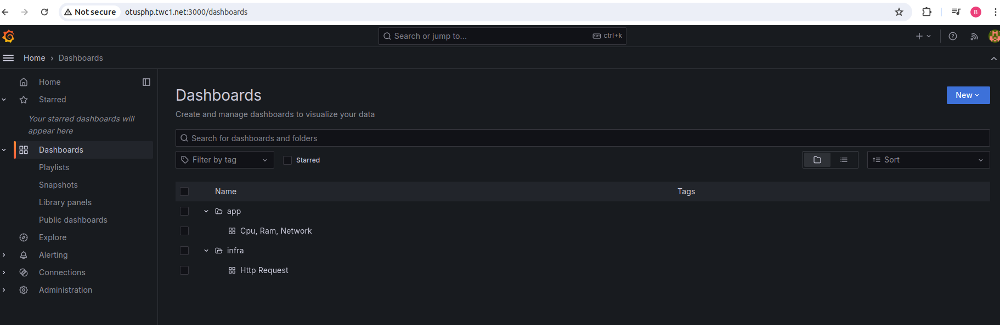
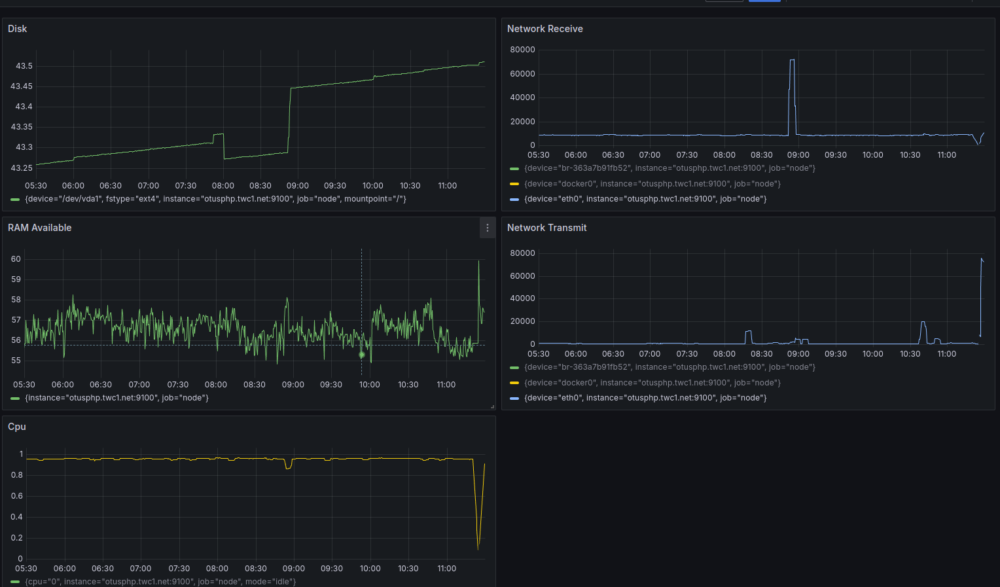
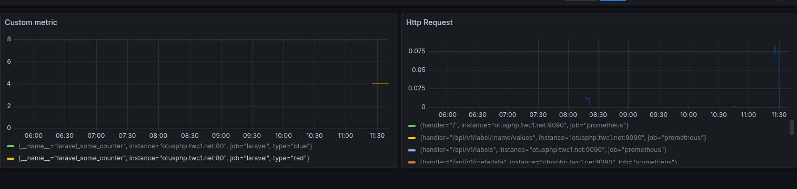

# Домашняя работа по настройке Grafana

В этой домашней работе установил Grafana последней доступной версии на виртуальную машину (VM) с Prometheus. Затем настроил Grafana и создал два дашборда для мониторинга инфраструктуры и приложения.

## Структура папок

В Grafana мы создал две папки:

1. `infra`: В этой папке находится дашборд для мониторинга инфраструктуры, такой как использование CPU, RAM, сети, диска

2. `app`: В этой папке находится дашборд для мониторинга CMS (системы управления контентом).
   

## Дашборд "infra"

Дашборд "infra" предоставляет обзор состояния инфраструктуры, включая следующие метрики:

- Использование ЦП (rate(node_cpu_seconds_total{mode="idle"}[5m]))
- Потребление оперативной памяти (node_memory_MemAvailable_bytes / node_memory_MemTotal_bytes * 100)
- Загрузка сети входящий (rate(node_network_receive_bytes_total[5m]))
- Загрузка сети исходящий (rate(node_network_transmit_bytes_total[5m]))
- Использование дискового пространства (100 - (node_filesystem_avail_bytes * 100 / node_filesystem_size_bytes))
  

## Дашборд "app"

Дашборд "app" отображает ключевые метрики для мониторинга CMS, такие как:

- Костомная метрика CMS (laravel_some_counter)
- HTTP-запросы (rate(prometheus_http_request_duration_seconds_sum[5m]) / rate(prometheus_http_request_duration_seconds_count[5m])))
  

## Настройка

Для настройки дашбордов использоваль данные, собранные Prometheus с различных экспортеров. Визуализация метрик и создание панелей производились непосредственно в Grafana.
